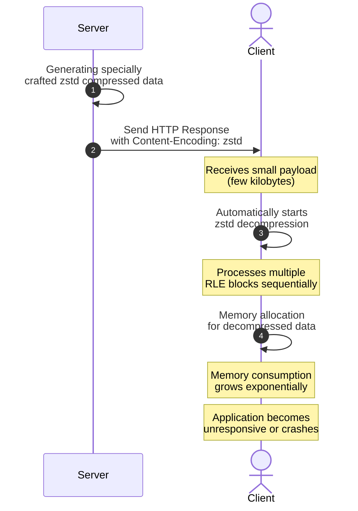

# DDoZ

Decompression Death of Zstandard (Zstd)

> A demonstration of client-side memory exhaustion attack using zstd decompression.

## Deployment

[](https://deploy.workers.cloudflare.com/?url=https://github.com/kazutoiris/DDoZ)

## Demo

[1TiB :collision:](https://hitomi.us.kg/bomb.html)

### Environment Variables

- `DECOMPRESSED_SIZE_IN_GIB`: Controls the size of data produced during decompression in GiB (default: 1 GiB)

## Introduction

DDoZ is a client-side memory exhaustion attack demonstration that exploits the zstd decompression process. Unlike traditional DDoS attacks that overwhelm servers with traffic, DDoZ targets clients by sending specially crafted zstd-compressed responses that cause excessive memory consumption during decompression on the client side.

This attack leverages the amplification effect of compression algorithms - a small compressed payload expands to a much larger size when decompressed. By controlling the decompressed size, the server can force clients to allocate enormous amounts of memory, potentially causing browser crashes, application freezes, or system instability.

## How It Works

DDoZ operates by:


The attack specifically targets client applications that automatically decompress HTTP responses, such as web browsers, API clients, or any software that handles HTTP content encoding transparently.

## Details

DDoZ exploits specific characteristics of the zstd compression format, particularly RLE blocks:

In the zstd format, RLE blocks work by repeating a single byte value Block_Size times. An RLE block consists of:
- Block header (3 bytes) containing block metadata
- Single byte content that gets repeated

So, a 4-byte structure (3-byte header + 1-byte content) can produce up to 128KiB of decompressed data. By chaining multiple RLE blocks, we can achieve massive amplification ratios. The amplification rate is calculated as:
```math
\lim_{n \to \infty} \frac{128 \times 1024 \times n}{6+4n} = 32768
```

## Related Projects

- [Zip Bomb](https://en.wikipedia.org/wiki/Zip_bomb) - A similar concept using ZIP archives
- [Zip of Death](https://github.com/iamtraction/ZOD) - Compression-based attack demonstration using ZIP files
